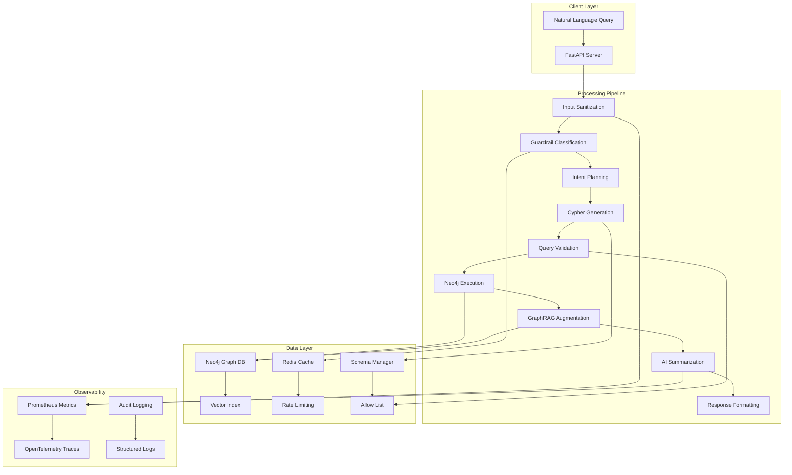

# GraphRAG: Production-Grade AI-Graph Integration System

A sophisticated, security-first Graph-backed Retrieval Augmented Generation (GraphRAG) system that enables natural language querying of Neo4j knowledge graphs with AI-powered reasoning, validation, and contextual augmentation.

## 🎯 System Overview

GraphRAG bridges the gap between natural language understanding and graph database reasoning through a dual-pipeline architecture that ensures both safety and intelligence. The system transforms unstructured queries into validated, schema-compliant Cypher operations while providing AI-enhanced contextual understanding and summarization.

### Core Mission
Enable users to query complex graph databases using natural language while maintaining:
- **Schema Safety**: All queries validated against live database schema
- **Query Security**: Protection against injection and unauthorized access
- **Contextual Intelligence**: AI-powered result interpretation and summarization
- **Production Reliability**: Comprehensive observability, rate limiting, and graceful degradation

## 🏗️ System Architecture



### Data Flow Architecture

**Pipeline 1: Schema Bootstrap (Startup)**
1. **Schema Extraction**: Live Neo4j schema → `allow_list.json` + fingerprint
2. **Embedding Generation**: Schema terms → vectorized embeddings
3. **Index Creation**: Vector index for semantic similarity search
4. **Idempotent Validation**: Fingerprint-based change detection

**Pipeline 2: Query Processing (Runtime)**
1. **Input Sanitization**: Malicious content detection and cleaning
2. **Intent Classification**: Guardrail-based query categorization
3. **Semantic Planning**: LLM-driven intent extraction and parameter mapping
4. **Cypher Generation**: Template-based or LLM-generated query construction
5. **Validation Layer**: Schema compliance, parameterization, and safety checks
6. **Graph Execution**: Read-only Neo4j query execution with timeout protection
7. **Context Augmentation**: Related node retrieval and graph traversal
8. **AI Summarization**: LLM-powered result interpretation with citation verification

## 🔧 Core Features & Innovations

### Automated Schema Management
- **Live Schema Extraction**: Dynamic `CALL db.schema.visualization()` integration
- **Fingerprint-Based Change Detection**: SHA-256 hashing for idempotent operations
- **Allow-List Generation**: Comprehensive label, relationship, and property cataloging
- **Vectorized Schema Terms**: Embedding-based semantic similarity for query mapping

### Security-First Query Processing
- **Multi-Layer Validation**: Input sanitization → Guardrail classification → Schema validation
- **Parameterized Query Enforcement**: Prevents injection through mandatory parameterization
- **Depth Limiting**: Configurable traversal depth caps (`max_traversal_depth: 2`)
- **Result Size Control**: Automatic `LIMIT` injection and result count validation
- **Read-Only Enforcement**: Mode-based write operation blocking

### AI-Powered Graph Reasoning
- **Template-Based Fast Paths**: Deterministic queries for common intents (`goals_for_student`, `case_manager_for_student`)
- **LLM Fallback Generation**: Schema-guided Cypher generation with validation
- **Semantic Mapping**: Name normalization and case-insensitive matching
- **Contextual Augmentation**: Dynamic graph traversal for related entity retrieval
- **Citation Verification**: Ensures all referenced entities exist in provided context

### Production-Grade Observability
- **Prometheus Metrics**: Query latency, success rates, LLM call counts, validation failures
- **OpenTelemetry Tracing**: End-to-end request tracing with span attributes
- **Structured Audit Logging**: Comprehensive event recording for compliance and debugging
- **Health Checks**: Service dependency validation and status reporting
- **Rate Limiting**: Redis-based LLM call throttling with configurable limits

## 🛠️ Technical Challenges & Solutions

### Schema Drift Management
**Challenge**: Maintaining schema consistency across deployments and database changes.
**Solution**: Fingerprint-based change detection with idempotent bootstrap operations. Schema changes trigger automatic re-embedding and allow-list regeneration.

### LLM Query Injection Prevention
**Challenge**: Preventing malicious or malformed queries from LLM-generated Cypher.
**Solution**: Multi-layer defense: input sanitization, allow-list validation, mandatory parameterization, and read-only mode enforcement.

### Graceful Service Degradation
**Challenge**: Maintaining system availability when external services (Neo4j, Redis, LLM) are unavailable.
**Solution**: Comprehensive fallback modes with mock embeddings, cached responses, and graceful error handling.

### High-Concurrency LLM Management
**Challenge**: Managing expensive LLM calls under high load.
**Solution**: Redis-based rate limiting with configurable per-minute limits and intelligent retry logic.

## 🚀 Tech Stack & Rationale

| Component | Technology | Rationale |
|-----------|------------|-----------|
| **API Layer** | FastAPI | Async-first, high performance, excellent OpenAPI integration |
| **Graph Database** | Neo4j | Native graph queries, vector index support, ACID compliance |
| **LLM Integration** | Google Gemini | Reliable, high-quality reasoning, structured output support |
| **Cache & Rate Limiting** | Redis | Efficient in-memory operations, atomic counters |
| **Observability** | Prometheus + OpenTelemetry | Unified metrics and tracing stack |
| **Validation** | Pydantic | Type-safe data validation and serialization |
| **Containerization** | Docker | Consistent deployment and environment isolation |

## 📦 Installation & Setup

### Prerequisites
- Python 3.11+
- Neo4j 5.0+ with APOC procedures
- Redis 6.0+
- Google Gemini API key

### Quick Start

1. **Clone and Install**
```bash
git clone <repository-url>
cd graphrag-application
pip install -r requirements.txt
```

2. **Environment Configuration**
```bash
# .env file
NEO4J_URI=bolt://localhost:7687
NEO4J_USER=neo4j
NEO4J_PASSWORD=your_password
GEMINI_API_KEY=your_gemini_api_key
REDIS_URL=redis://localhost:6379/0
APP_MODE=read_only
ALLOW_WRITES=false
```

3. **Schema Bootstrap** (Optional)
```bash
# Automated schema extraction and embedding generation
APP_MODE=admin ALLOW_WRITES=true python main.py
```

4. **Start Service**
```bash
# Production mode
APP_MODE=read_only ALLOW_WRITES=false python main.py

# Development mode with mock embeddings
DEV_MODE=true python main.py
```

5. **Access Documentation**
- API Docs: http://localhost:8000/docs
- Metrics: http://localhost:8001/metrics
- Health Check: http://localhost:8000/health

## 🔍 Usage Examples

### Natural Language Querying

**Query**: "What are the goals for Isabella Thomas?"

**Response Structure**:
```json
{
  "query": "What are the goals for Isabella Thomas?",
  "cypher": "MATCH (s:Student {fullName: $student}) -[:HAS_PLAN]->(:Plan)-[:HAS_GOAL]->(g:Goal) RETURN g.title AS goal, coalesce(g.status, '') AS status ORDER BY g.title LIMIT $limit",
  "params": {"student": "Isabella Thomas", "limit": 20},
  "results": [
    {"goal": "Improve reading comprehension", "status": "In Progress"},
    {"goal": "Develop study habits", "status": "Completed"}
  ],
  "summary": "Isabella Thomas has 2 active goals focused on academic improvement: reading comprehension (in progress) and study habits (completed).",
  "citations": ["Student: Isabella Thomas", "Goal: Improve reading comprehension"],
  "metadata": {
    "execution_time_ms": 45,
    "result_count": 2,
    "intent": "goals_for_student"
  }
}
```

### Administrative Operations

**Schema Refresh**:
```bash
curl -X POST http://localhost:8000/admin/schema/refresh
```

**Response**:
```json
{
  "status": "success",
  "duration_s": 2.47,
  "steps_completed": [
    "schema_extraction",
    "embedding_generation", 
    "vector_index_creation"
  ]
}
```

## ⚡ Performance & Scalability

### Optimization Strategies
- **Vector Index Utilization**: HNSW-based similarity search for schema term matching
- **Asynchronous I/O**: FastAPI's async/await for concurrent request handling
- **Query Depth Limiting**: Configurable traversal caps prevent runaway queries
- **Result Size Control**: Automatic LIMIT injection and validation
- **Redis-Based Throttling**: Efficient LLM call rate limiting
- **Idempotent Operations**: Schema bootstrap caching prevents redundant work

### Scalability Considerations
- **Horizontal Scaling**: Stateless FastAPI service enables load balancing
- **Database Optimization**: Neo4j clustering and read replicas
- **Caching Strategy**: Redis-based response caching for common queries
- **Resource Management**: Configurable timeouts and memory limits

## 🔮 Future Enhancements

### Incremental Schema Management
- **Real-time Schema Monitoring**: Webhook-based change detection
- **Incremental Embedding Updates**: Delta-based schema term processing
- **Automated Refresh Triggers**: Event-driven schema synchronization

### Advanced Security
- **Role-Based Access Control**: Fine-grained query validation per user role
- **Query Pattern Analysis**: ML-based anomaly detection for suspicious queries
- **Audit Trail Enhancement**: Comprehensive compliance reporting

### Performance Optimization
- **Streaming Responses**: Real-time result streaming for long-running queries
- **Distributed Embedding Cache**: Multi-node embedding storage and retrieval
- **Model Adaptation**: Fine-tuned LLM models for domain-specific reasoning

## 🎓 Engineering Philosophy

### Design Principles

**"AI Must Respect the Schema"**: Every AI-generated operation is validated against the live database schema, ensuring deterministic behavior and preventing data corruption.

**Safety Through Validation**: Multi-layer validation prevents both accidental and malicious query execution while maintaining system flexibility.

**Observability First**: Comprehensive metrics, tracing, and logging enable rapid debugging and performance optimization in production environments.

**Modular Architecture**: Clean separation of concerns enables independent scaling, testing, and maintenance of system components.

### Implementation Philosophy

This system represents a commitment to **correctness over convenience**, **transparency over abstraction**, and **reproducibility over speed**. Every component is designed for long-term maintainability, with comprehensive testing, clear documentation, and robust error handling.

The architecture prioritizes **deterministic graph reasoning** enhanced by **intelligent AI augmentation**, creating a system that is both powerful and trustworthy for production use.

---

## 📄 License

[License information]

## 🤝 Contributing

[Contributing guidelines]

## 📞 Support

[Support information]